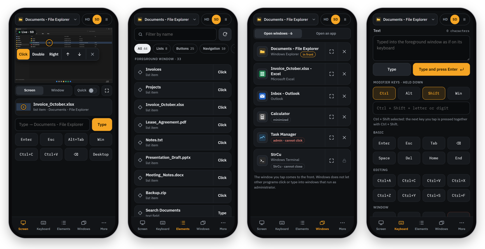
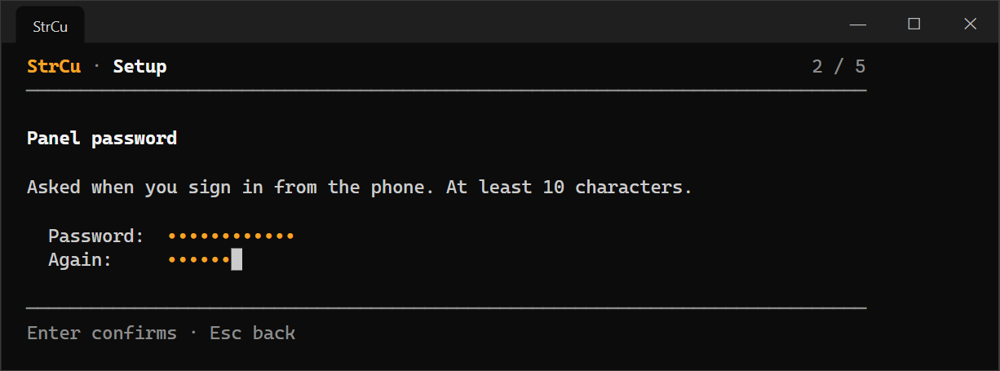
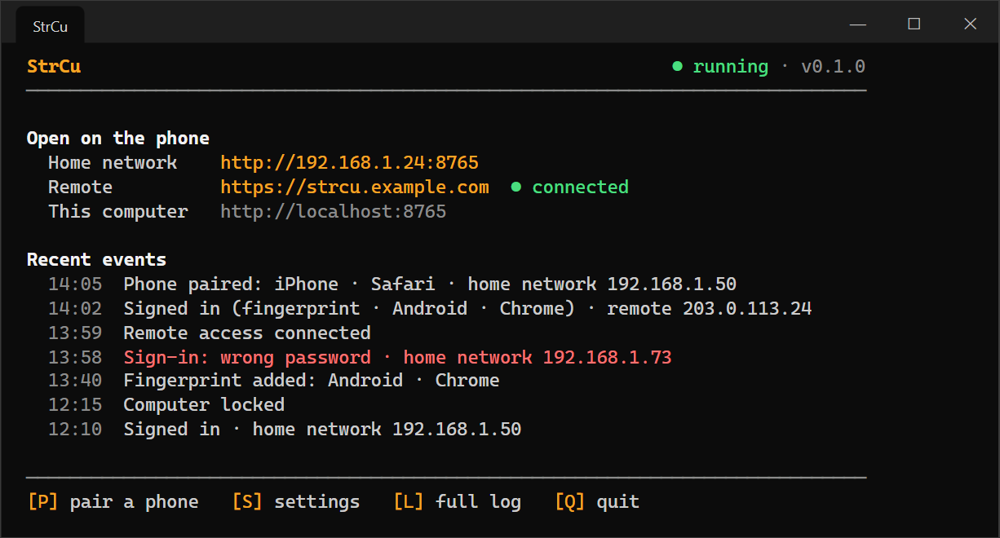
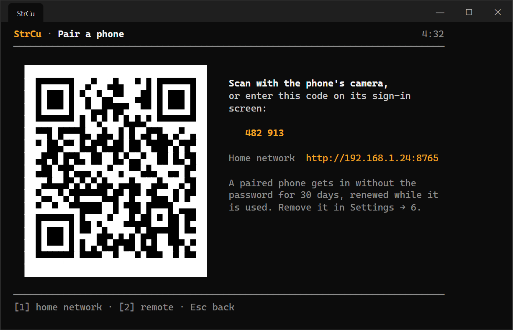
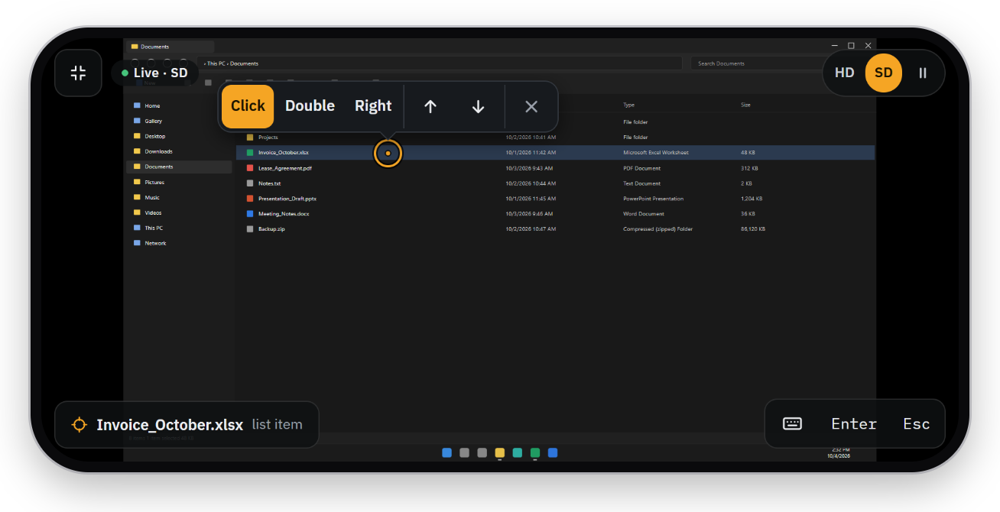

# StrCu

**Control your Windows PC from your phone.**

When you are away from the desk, StrCu replaces calling someone at home and talking them through "open that
program, click there". It is a single exe that serves a web panel; the phone needs nothing but its browser.

<p align="center">
  
</p>

- **See the screen live** and tap to aim a crosshair; then click, double-click, right-click, scroll or type.
- **Know what you are about to click.** Windows' own accessibility data (UI Automation) names the element under
  the crosshair and lists everything clickable in the window. No AI, no GPU, no extra install.
- **Windows and apps:** bring a window to the front, maximize or close it; open any app from the Start menu.
- **Keyboard:** type text into the foreground window, send shortcuts (Ctrl / Alt / Shift / Win held for the next
  key), F1–F12.
- **On your home Wi-Fi** out of the box, and **from anywhere** through a free Cloudflare Tunnel if you want.
- **Sign in** with a password, pair a phone once with a QR code, or use a passkey (fingerprint / Face ID).
- English and Turkish.

## Install

In PowerShell (Windows 10 or 11, no administrator rights needed):

```
irm https://github.com/sakirsek/strcu/releases/latest/download/install.ps1 | iex
```

It downloads the latest release, checks its SHA-256 checksum, installs it to `%LOCALAPPDATA%\strcu`, adds
StrCu to the Start menu and the desktop, and opens it for the first-start setup. Running the same line again
updates StrCu (a running StrCu is closed and started again; settings stay). To remove StrCu with all its
settings, shortcuts and its start with Windows:

```
& ([scriptblock]::Create((irm https://github.com/sakirsek/strcu/releases/latest/download/install.ps1))) -Uninstall
```

The exe can also be downloaded by hand from [Releases](https://github.com/sakirsek/strcu/releases), next to its
`strcu.exe.sha256`. It is not code-signed, so Windows SmartScreen may stop it with "Windows protected your PC":
choose **More info → Run anyway**. The one-line install does not meet this, since files PowerShell downloads
are not marked as coming from the internet.

## First start



StrCu opens in a terminal window. The first start is a short setup:

1. **Language** (Windows' display language is offered first).
2. **Panel password**, at least 10 characters (kept as an argon2 hash).
3. **Home network:** whether phones on your Wi-Fi may reach the panel. Windows then asks once whether StrCu may
   accept connections; with "Private networks" selected, choose Allow.
4. **Remote access** through Cloudflare, optional and possible later ([below](#remote-access-optional)).
5. **Start with Windows** (minimized).



After that the main screen shows where the phone can open the panel and the important events: sign-ins and
failed attempts with where they came from, phones paired, fingerprints added, the computer locked, the tunnel
coming and going. **P** pairs a phone, **S** opens the settings (language, password, home network, remote
access, start with Windows, paired phones and fingerprints, port), **L** shows the full log and **Q** quits.

Only one StrCu runs at a time; starting it again brings the running one's window to the front. Closing the
window stops the panel and the tunnel. While StrCu runs, the computer does not go to sleep (the display may
still turn off). For a laptop that works with its lid closed, set Windows to do nothing when the lid is closed.

## Connect a phone



Press **P** on the main screen and scan the QR code with the phone's camera, or open the address shown and type
the six-digit code under "Pair with a code from the computer". The paired phone gets in without the password
for 30 days, renewed while it is used. The password works too, from any browser.

The phone and the computer must be on the same Wi-Fi, and Windows must count that network as *Private*: on a
*Public* network (café, hotel) home network access turns itself off. To change it: Settings → Network &
internet → Wi-Fi → your network → Network profile type → Private.

## The panel

Five tabs: Screen, Keyboard, Elements, Windows, More.

- **Top bar:** the foreground window with its app icon; tap it for the list of open windows. Shows when the
  computer is locked. Next to it, the live view controls (HD / SD / ❚❚).
- **Screen:** a tap aims the crosshair; a bar with Click / Double / Right, ↑ / ↓ (scroll) and ✕ appears next to
  it. Below the image, a magnifier and the element's name. A typing box and eight common keys sit underneath.
- **Live view:** SD scales the long side to 1280 pixels, HD sends full resolution. The image refreshes every
  2.5 s while the Screen tab is open; ❚❚ freezes it.
- **Keyboard:** a text box (types into the foreground window), modifier keys held for the next key, common keys,
  arrows, F1–F12 and recent shortcuts.
- **Elements:** named clickable elements of the foreground window and the taskbar, filterable by name and kind.
- **Windows:** open windows with their app icons; bring to front, maximize or close. **Open an app** lists the
  Start menu apps (classic and Store) with search and recent apps.
- **More:** session and sign-out, passkeys, lock and shut down (with a 15 s countdown that can be cancelled),
  panel language and a log of what was done.

**Full screen:** ⛶ or turn the phone sideways. Pinch to zoom, drag to pan, tap to aim.



The page loads nothing from outside; its fonts (IBM Plex) are built in.

**What it cannot do:**

- Unlock the computer. A locked computer shows as locked; locking works, unlocking needs someone at the desk.
- Click or type into windows that run as administrator (often Task Manager and installers): Windows does not
  let a normal program do that. The same goes for the UAC prompt.

## Remote access (optional)

From outside the home, the panel is reached through a Cloudflare Tunnel protected by Cloudflare Access. You need
a Cloudflare account and a domain whose DNS is on Cloudflare; the tunnel and Access are free. No Windows service
or administrator rights: StrCu runs cloudflared as its own child process, watches its connection, starts it
again if it stops, and closes it with the panel.

It is set up from the terminal (in the first-start setup, or Settings → Remote access), which walks through the
Cloudflare dashboard and checks each step:

1. cloudflared is downloaded (a pinned version, verified with SHA-256).
2. **Tunnel:** Networking → Tunnels → Create a tunnel. The install command it shows is pasted into StrCu,
   not run. StrCu starts the tunnel at once, so the dashboard sees it connect and lets you go on.
3. **Address:** on the tunnel's Routes tab, Add route → Published application, with the Service URL
   `http://localhost:8765` (the port StrCu shows).
4. **Access:** Zero Trust → Access controls → Applications → Create new application → Self-hosted and private,
   for that address, with a policy that allows your email. StrCu opens the address and reads the team domain
   and the application's AUD tag from Access's own sign-in redirect; if Access is missing it says so.
5. The allowed email.

A remote request passes three gates: Cloudflare Access (email + one-time code), then StrCu's own check of the
Access token on every request (signature, AUD, email), then the panel password, a paired phone or a passkey.
Without Access settings the tunnel does not open at all.

Remote access is HTTPS, so passkeys work there: the phone signs in with its fingerprint or face instead of the
password (added under More, which asks for the password once).

## Who can get in

Every request is placed by where its connection really comes from (the socket's addresses and, for one from
this computer, the program that opened it), not only by its headers.

- **This computer:** a browser in the same Windows session gets in without signing in. A connection opened by
  another Windows user signed in to the same computer is refused. Only `localhost` as the address: a site
  that points its own name at 127.0.0.1 is treated as remote (DNS rebinding).
- **Home network** (when turned on): private addresses (192.168.x, 10.x, 172.16-31.x) on a network Windows
  counts as *Private*. The address typed must be the computer's IP or its name. Sign-in with the panel password
  or a paired phone. The connection is plain HTTP, so anyone on the same Wi-Fi could read it; browsers offer no
  passkeys there.
- **Remote:** through the Cloudflare tunnel, above. Connections opened by cloudflared always count as remote.
- **Anything else** is refused, with the reason shown in the visitor's language and written to the log (once a
  minute per address).

Five wrong passwords lock that source out for five minutes; each address has its own count, so a guesser on
the home network cannot lock out remote sign-in. A password or passkey session lasts 12 hours.

Pairing (`src/pair.rs`): the code is open only while its screen is shown, for five minutes, works once, and
closes after five wrong tries. The QR code carries it after `#`, which browsers never send to the server, and
the panel removes it from the address at once. The paired phone's `HttpOnly` cookie works only at the address
it was paired on, and only a SHA-256 hash of its secret is kept. Remove a phone in Settings → 6, or from the
phone with "Unpair" under More.

Passkeys (`src/passkey.rs`): the private key never leaves the phone; StrCu keeps the public key and checks the
one-time challenge, origin, site hash, user verification, ES256 signature and signature counter. No attestation
is requested; adding a key requires the panel password instead.

The port is held for StrCu alone (`SO_EXCLUSIVEADDRUSE`), so no other program can listen on 127.0.0.1 at the
same port and receive this computer's connections, the tunnel's among them.

## Command line

```
strcu                             # the terminal app: setup on the first start, then the main screen
strcu serve [--bind 127.0.0.1:8765] [--no-tunnel]   # no screens, status lines only (scripts, services)
strcu passwd                      # panel password from the command line
strcu tunnel install | token | setup --hostname <host> --email <email> | status
strcu doctor                      # inspect the system, write %LOCALAPPDATA%\strcu\profile.json
strcu licenses                    # licenses of the third-party software built in
```

Developer tools drive the operating system layer directly (coordinates are physical pixels everywhere):

```
strcu dev shot -o screen.jpg --max-side 1280
strcu dev elements [--all]        # visible clickable elements (UI Automation)
strcu dev find "Save" --click     # find by name and click (--double)
strcu dev at 689 919              # element at a point
strcu dev click 689 919 --button right
strcu dev type "Unicode text: şğüöçıİ é ß"
strcu dev key ctrl+shift+esc
strcu dev windows | focus <name> [--maximize] | close <name>
strcu dev apps                    # apps in the Start menu
strcu dev launch "Calculator"     # launch an app (full or partial name)
strcu dev lockstate | lock | awake [--display]
strcu dev shutdown [--secs 15] | shutdown --cancel
strcu dev preview --lang tr       # every terminal screen with made-up data, as HTML pages
```

## Build from source

With [Rust](https://rustup.rs) (the MSVC toolchain) on Windows:

```
cargo build --release
target\release\strcu.exe
```

## Languages

The panel follows the phone's language and can be switched under More; the terminal's language is chosen in
the setup and changed in Settings. Every text lives in `lang/<code>.json`, shared by the panel and the
terminal; a language is added by adding a file (the `_name` key holds its own name, `{name}` placeholders are
filled in, `{"one": ..., "other": ...}` gives plural forms). The tests check that every file has the same keys
and placeholders as `lang/en.json`.

## Layout

- `src/sys/` operating system layer (screen, input, windows, UI Automation, power, apps, icons, discovery,
  child processes)
- `src/server.rs` + `src/web/` the panel; `src/worker.rs` runs operating system work in order on one thread
- `src/app.rs` what runs while StrCu is open (listener, tunnel watcher); `src/tui/` the terminal screens, plain
  functions from state to frames that the terminal draws and `strcu dev preview` turns into HTML
- `src/auth.rs` sign-in, `src/pair.rs` paired phones, `src/passkey.rs` passkeys, `src/access.rs` Cloudflare
  Access verification
- `src/i18n.rs` + `lang/` languages; the server sends message keys, the panel and the terminal render them
- `src/tunnel.rs` cloudflared management, `src/download.rs` downloads verified with SHA-256
- `install.ps1` the one-line installer; `.github/workflows/` CI, releases and the third-party notices check

## License

MIT, see [LICENSE](LICENSE). The software built into strcu.exe and its licenses are listed in
[THIRD-PARTY-NOTICES.txt](THIRD-PARTY-NOTICES.txt) (made with cargo-about, see `about.toml`), which
`strcu licenses` also prints. The embedded IBM Plex fonts are under the SIL Open Font License
([src/web/fonts/OFL.txt](src/web/fonts/OFL.txt)). cloudflared, downloaded when remote access is set up, is
Cloudflare's, under the Apache License 2.0.

The screenshots show made-up data.
